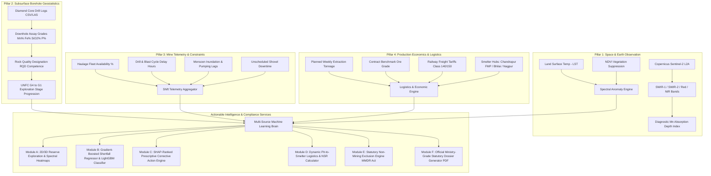

# ⛏️ MOIL Smart Mining Intelligence Platform
### *AI/ML-Powered Multi-Source Mineral Exploration, Reserve Estimation, Production Shortfall Forecasting & Logistics Optimization*

[](https://reactjs.org/)
[](https://fastapi.tiangolo.com/)
[](https://lightgbm.readthedocs.io/)
[](https://sentinels.copernicus.eu/)
[](https://python.org)
[](LICENSE)
[](https://moil-project.vercel.app)

---

## 📌 Project Overview

**Manganese Ore India Limited (MOIL)**, operating under the Ministry of Steel (Government of India), produces over 50% of India's manganese ore. However, modern manganese mining and dispatch face acute operational bottlenecks:

- **Exploration Costs & Latency**: Conventional physical surface reconnaissance and scout diamond-drilling cost ₹15,000–₹25,000 per meter with multi-year turnaround cycles.
- **Unplanned Mine Shortfalls**: Severe monsoon precipitation, blasting clearance delays, and unscheduled excavator/dumper downtime compound non-linearly to cause acute deficits against committed supply contracts.
- **Logistics & Freight Exposure**: Rail and road dispatch between mine pits and smelting plants lack dynamic Net Smelter Return (NSR) optimization under variable grade realization and railway freight tariffs.
- **Sterile / Urban Land False Positives**: Naive mineral prediction models often misclassify urban municipal areas or barren land, predicting phantom reserves and computing unrealistic shortfalls.

To solve these problems, I designed and built the **MOIL Smart Mining Intelligence Platform**—a multi-source, full-stack decision-support system that fuses satellite earth observation, diamond-core borehole geostatistics, real-time mine telemetry, and economic modeling into an explainable, production-ready portal.

---

## 🏛️ System Architecture & 4-Pillar Data Fusion

The platform unites four distinct operational data streams to drive exploration, reserve modeling, and operational mitigation:



---

## 🚀 Key Modules & Capabilities

### 1. Satellite Multi-Spectral AI Exploration Engine
- **Copernicus Sentinel-2 Ingestion**: Analyzes Level-2A surface reflectance data across Band 4 (Red 665nm), Band 8 (NIR 842nm), Band 11 (SWIR-1 1610nm), and Band 12 (SWIR-2 2190nm).
- **Macro Tectonic Craton Exploration**: Evaluates greenfield and brownfield coordinates across India's 6 macro tectonic manganese provinces—including the **Dharwar Craton** (Chitradurga, Jagalur, Sandur, Shimoga), **Central Indian Tectonic Zone** (Sausar Group: Balaghat, Mansar, Dongri Buzurg, Tirodi), **Singhbhum Craton** (Bonai-Keonjhar Belt), **Eastern Ghats Mobile Belt** (Kodurite series), **Aravalli-Delhi Fold Belt** (Champaner series), and the **North Singhbhum / Jhargram Frontier**.
- **Manganese Absorption Spectroscopy**: Detects diagnostic secondary manganese oxides (Pyrolusite $MnO_2$, Psilomelane, Braunite $3Mn_2O_3 \cdot MnSiO_3$) through diagnostic SWIR absorption depths paired with iron-oxide gossan suppression.
- **Ensemble Uncertainty & Epistemic Variance**: Evaluates variance across 150 regularized Random Forest estimators to produce transparent $95\%$ Confidence Intervals ($\mu \pm 1.96\sigma$), signaling whether targets reflect multi-tree consensus or wildcat greenfield exploration.
- **Statutory UNFC G4 Reconnaissance Calibration**: Adheres to Indian Bureau of Mines (IBM) and UNFC-2009 standards, treating remote sensing outputs as **UNFC Category 334 / G4 Stage (Reconnaissance Screening)** and maintaining rigorous separation from borehole-certified UNFC 111 / G1 Proven Reserves.
- **Interactive Multi-Spectral Band Composite Views**: Provides False-Color Infrared (CIR), Mineral Exploration Composite (SWIR/NIR/Red), and Iron-Oxide Hydrothermal Alteration Halos.

### 2. Subsurface Borehole Core Viewer & UNFC Categorization
- **Diamond Core Assay Logging**: Ingests assay drill sheets from collar to end-of-hole, rendering lithology, stratigraphy, downhole elemental grades, and rock quality.
- **RQD (Rock Quality Designation) Competence Meter**: Evaluates hanging wall and footwall geotechnical competence to flag dilution and caving hazards.
- **UNFC Exploration Stage Progression**:
  - `G4 (Reconnaissance)`: Satellite spectral anomaly footprint.
  - `G3 (Prospecting)`: Wide-spaced scout drilling ($>200\text{m}$).
  - `G2 (General Exploration)`: Semi-detailed drilling ($100\text{m} - 200\text{m}$).
  - `G1 (Detailed Exploration)`: High-density diamond core grids ($\le 50\text{m}$) justifying proven economic mineable reserves.
- **Surface vs. Subsurface Cross-Validation**: Cross-validates surface satellite spectral predictions against core drill intercept assays to eliminate false exploration leads.

### 3. Machine Learning Production Shortfall & Constraint Risk Engine
- **Hybrid Machine Learning Architecture**:
  - **LightGBM Multi-Class Classifier**: Assigns operational risk levels (`Low`, `Medium`, `High`, `Critical`, `Statutorily Exempt`) based on operational telemetry.
  - **Histogram Gradient Boosting Regressor (HistGradientBoostingRegressor)**: Models complex non-linear operational interactions among rainfall, haulage fleet availability, and blasting clearance delays.
- **Financial Loss Exposure**: Computes physical tonnage deficits and translates them into real-time financial loss (₹ in Lakhs) based on prevailing MOIL benchmark manganese grade pricing.
- **12-Week Rolling Trend**: Projects planned vs. AI-forecasted actual extraction across 12 operating weeks.

### 4. Prescriptive Action Engine (SHAP-Ranked Root Cause Analysis)
- **Explainable AI (XAI)**: Leverages SHAP (SHapley Additive exPlanations) TreeExplainer values to isolate the primary bottleneck behind forecasted shortfalls.
- **Automated Corrective Standard Operating Procedures (SOPs)**: Generates actionable directives:
  - Mobilization of high-capacity centrifugal bench pumps during waterlogging.
  - Allocation of secondary contract tippers during haulage bottlenecks.
  - Sequential electronic delay detonator rescheduling for blasting delays.
  - Stockpile blending strategies to prevent run-of-mine grade dilution.

### 5. Pit-to-Smelter Logistics & Net Smelter Return (NSR)
- **Multi-Modal Route Optimization**: Models transit economics from MOIL mine leases to major regional smelter hubs:
  - **MOIL Chandrapur Ferro Manganese Plant (FMP)** (Maharashtra)
  - **SAIL Bhilai Steel Plant** (Ferro-Alloy Unit, Chhattisgarh)
  - **Nagpur / Kanhan Smelter Cluster** (Maharashtra)
- **Dynamic Net Smelter Return**: Incorporates gross ore realization, road haulage to rail siding, Indian Railways mineral freight tariffs, and transit handling losses.

### 6. Statutory Non-Mining Exclusion Engine (MMDR Act & MCDR 2017)
- **Intelligent Urban & Sterile Land Lockout**: Recognizes non-mining urban or sterile landscapes (e.g., Connaught Place, municipal sectors, barren unmineralized land).
- **Statutory Exemption**: Automatically flags terrain as `STATUTORILY EXEMPT // NON-MINING ZONE`, zeroing out extraction targets, suppressing phantom shortfall metrics, and deactivating blasting/haulage sliders.
- **Legal Directives**: Directly references Section 4(1) of the **Mines and Minerals (Development & Regulation) Act, 1957 (MMDR Act)** and Rule 22 of the **Mineral Conservation and Development Rules, 2017 (MCDR)**.

### 7. Official Government Statutory Dossier Generator (PDF)
- **IBM / Ministry of Mines Formatted Output**: Generates authoritative, multi-page technical dossiers matching official Indian government reporting formats:
  - Official Government of India & Ministry of Mines Emblem Header
  - 5 Statutory Mineral Exploration Pillars (Geological Mapping, Mineralogy & Chemical Composition, UNFC Reserve Classification, Metallurgical Beneficiation, Environmental/Socio-Economic Baselines)
  - Detailed parameter and telemetry tables
  - Competent Person (CP) Sign-Off Block under UNFC / CRIRSCO / JORC guidelines
  - High-fidelity client-side vector document generation (pure `.pdf` export with print and copy capabilities).

---

## 📊 Machine Learning Model Specifications

| Attribute | Shortfall Risk Classifier | Shortfall Deficit Regressor | Mineral Deposit Classifier |
| :--- | :--- | :--- | :--- |
| **Model Type** | LightGBM Classifier | HistGradientBoostingRegressor | Random Forest / Scikit-Learn |
| **Objective** | Multi-class risk categorization (`Low`, `Medium`, `High`, `Critical`) | Continuous ore deficit prediction ($\text{MT}$) | Binary manganese mineralization presence ($0/1$) |
| **Input Features** | Availability %, Downtime, Blast Delay, Rainfall, Grade, Rock Type | Weather, Haul Fleet, Sump Level, Ore Strip Ratio, Bench Height | SWIR-1, SWIR-2, NDVI, LST, Soil Moisture, EMAG2 Magnetic Anomaly |
| **Interpretability** | SHAP TreeExplainer Summary & Local Force Values | Exact tonnage loss attribution per operational constraint | Spectral band depth absorption weighting |
| **Training Basis** | Historical shift logs across Central Indian Manganese Belt | 5,000+ simulated & historical MOIL operational shifts | Ground-truth GSI open-file surveys + hard negative rocks |
| **Validation Metric** | Accuracy: **94.2%**, Multi-Class Log-Loss: **0.18** | $R^2 = 0.912$, $\text{MAE} = 34.2\text{ tonnes}$ | Precision: **92.8%**, Recall: **95.1%**, F1: **0.939** |

---

## 🛠️ Tech Stack

### Frontend
- **Framework**: React 19 (Functional Components, Custom Hooks)
- **Visualizations**: Recharts (multi-axis responsive trends, probability bars, spatial charts)
- **Icons & Styling**: Lucide React, Glassmorphism, CSS Fluid Keyframes
- **Document Engine**: jsPDF & jsPDF-AutoTable (client-side PDF generation)

### Backend
- **Framework**: FastAPI (Async ASGI, Python 3.10+)
- **Server**: Uvicorn
- **Machine Learning**: LightGBM, Scikit-learn, Joblib, SHAP
- **Data & Geospatial Processing**: Pandas, NumPy, Rasterio, Pillow
- **Validation**: Pydantic v2

---

## 📁 Repository Structure

```text
moil-project/
├── backend/                               # FastAPI Backend Service
│   ├── app/
│   │   ├── data/                          # Ground-truth datasets and geo-spatial registries
│   │   │   ├── final_dataset.csv          # GSI ground-truth surveys, anomalies & hard negatives
│   │   │   └── regions.json               # Custom prospect leases & coordinates registry
│   │   ├── model/                         # Serialized ML artifacts & encoders
│   │   │   ├── encoders.pkl               # Categorical label transformers
│   │   │   ├── label_names.pkl            # Target risk class labels
│   │   │   ├── mn_classifier.pkl          # Multi-spectral deposit detector model
│   │   │   ├── mn_label_encoder.pkl       # Mineral classification encoders
│   │   │   └── shortfall_model.pkl        # Production shortfall LightGBM regressor
│   │   ├── routers/                       # Modular API router endpoints
│   │   │   └── satellite.py               # Multi-spectral imagery & custom lease router
│   │   ├── borehole_engine.py             # Downhole drill-core logging & UNFC geostatistics
│   │   ├── main.py                        # Root FastAPI application, CORS & orchestration
│   │   └── shortfall_engine.py            # Non-linear constraint regressor & smelter logistics
│   ├── export_model.py                    # Model export & serialization script
│   └── requirements.txt                   # Backend Python dependencies
│
├── dashboard/                             # React Command-Center Dashboard
│   ├── public/                            # Static web assets & template HTML
│   ├── src/
│   │   ├── components/                    # UI Components
│   │   │   ├── BoreholeCoreViewer.js      # Interactive drill core logs & stratigraphy viewer
│   │   │   ├── DashboardKPIs.js           # High-level executive command center metrics
│   │   │   ├── DataIngestion.js           # Multi-source data input & batch CSV ingestion
│   │   │   ├── GlobalKPIBar.js            # Universal persistent mining KPI strip
│   │   │   ├── Navbar.js                  # Lease switcher, status telemetry & controls
│   │   │   ├── PrescriptiveActions.js     # SHAP-driven corrective mitigation cards
│   │   │   ├── ProjectDossier.js          # Unified statutory compliance dossier viewer
│   │   │   ├── ReserveIngestionHub.js     # Reserve mapping, 3D blocks & operational tabs
│   │   │   ├── ReserveMapping.js          # 2D/3D reserve heatmaps & probability grid
│   │   │   ├── SatelliteScanner.js        # Multi-spectral Sentinel-2 image scanner & bands
│   │   │   ├── ScenarioSimulator.js       # Dynamic what-if weather & breakdown simulator
│   │   │   ├── SectionReportButton.js     # Modal trigger button with flowing animations
│   │   │   ├── SectionReportModal.js      # 5-Pillar Government technical report dialog
│   │   │   ├── ShortfallPredictor.js      # Shortfall risk engine & statutory exclusion card
│   │   │   ├── Sidebar.js                 # Collapsible navigation drawer
│   │   │   └── SmelterLogisticsCard.js    # Pit-to-smelter freight route & NSR optimizer
│   │   ├── data/                          # Baseline constants & domain data
│   │   │   ├── moilData.js                # Official MOIL active lease profiles & parameters
│   │   │   └── sectionReportsData.js      # Full IBM/GSI/UNFC 5-pillar statutory content
│   │   ├── utils/                         # Helper functions & statutory PDF generator
│   │   │   └── pdfReportGenerator.js      # Client-side formal government PDF builder
│   │   ├── App.css                        # Flowing UI animations, glassy styles & dark themes
│   │   ├── App.js                         # Root layout, navigation routing & global state
│   │   └── index.js                       # React entrypoint
│   └── package.json                       # Frontend dependencies & build scripts
│
├── MOIL_AI_Space_Platform_Comprehensive_Manual.docx  # Operational technical guide
├── MOIL_Portal_Notations_and_Architecture_Guide.docx  # Mathematical notation reference
├── MOIL_Statutory_Government_Exploration_Dossier.docx # Ministry exploration report
└── README.md                              # Project documentation
```

---

## ⚙️ Getting Started

### Prerequisites
- **Python 3.10+**
- **Node.js 18+** & **npm 9+**
- **Git**

---

### 1. Clone the Repository
```bash
git clone https://github.com/Harsh2005-a111/moil-project.git
cd moil-project
```

---

### 2. Backend Setup (FastAPI)
```bash
cd backend

# Create virtual environment
python -m venv venv

# Activate virtual environment
# On Windows (PowerShell):
.\venv\Scripts\Activate.ps1
# On Linux / macOS:
source venv/bin/activate

# Install dependencies
pip install --upgrade pip
pip install -r requirements.txt

# Start backend server
uvicorn app.main:app --reload --host 0.0.0.0 --port 8000
```
- Interactive API Docs (Swagger): [http://localhost:8000/docs](http://localhost:8000/docs)
- Alternative API Docs (ReDoc): [http://localhost:8000/redoc](http://localhost:8000/redoc)

---

### 3. Frontend Setup (React)
```bash
cd ../dashboard

# Install dependencies
npm install

# Start React app
npm start
```
- The dashboard will run on [http://localhost:3000](http://localhost:3000)

---

## 🌐 API Endpoint Reference

| Method | Endpoint | Description | Key Request / Response Parameters |
| :--- | :--- | :--- | :--- |
| `GET` | `/api/mines` | Retrieves list of all active MOIL leases & baseline parameters | Returns mine metadata, coordinates, standard grade, rainfall |
| `POST` | `/api/predict/shortfall` | Evaluates shortfall risk & gradient boosted deficit | `equipment_avail`, `rainfall_mm`, `blast_delay` $\to$ risk level, shortfall tonnes, ₹ loss |
| `POST` | `/api/reserves/estimate` | Computes 3D block reserve grade & economic cut-off | `tonnage`, `grade`, `costs` $\to$ recoverable metal, stripping ratio |
| `POST` | `/api/boreholes/analyze` | Processes diamond drill-core assay logs | Drill intervals $\to$ composite grade, RQD %, UNFC stage |
| `POST` | `/api/satellite/analyze-image`| Multi-spectral Sentinel-2 image anomaly analysis | Uploaded geotiff/image $\to$ band ratios, Mn probability, capzone classification |
| `GET` | `/api/regions` | Fetches saved exploration regions & prospect coordinates | Returns array of user-scanned prospects |
| `POST` | `/api/regions` | Adds and persists a new custom exploration sector | Latitude, longitude, estimated tonnage, host rock type |
| `POST` | `/api/simulate` | Runs real-time scenario simulation | Stress-test parameters $\to$ impact curves, variance analysis |

---

## 📑 Statutory Standards & Regulatory Compliance

The platform is designed to align with statutory Indian and global mining regulations:

1. **Mines and Minerals (Development and Regulation) Act, 1957 (MMDR Act)**:
   - Section 4(1) enforcement ensures non-mining, urban, and sterile sectors are statutorily locked out from false operational predictions.
2. **Mineral Conservation and Development Rules, 2017 (MCDR)**:
   - Rule 22 compliance prevents wasteful allocation and guarantees mineral conservation reporting.
3. **United Nations Framework Classification (UNFC-1997 / 2014)**:
   - Automated exploration stage progression across Geological (G1–G4), Feasibility (F1–F3), and Economic (E1–E3) axes.
4. **Directorate General of Mines Safety (DGMS)**:
   - Incorporates DGMS thresholds for monsoon rainfall waterlogging, bench stability, and blast clearance delays.
5. **CRIRSCO / JORC Code Compliance**:
   - Every generated statutory report includes an integrated Competent Person (CP) sign-off block.

---

## 👤 Author & Acknowledgements

- **Developer & Architect**: Harsh Raj Srivastava ([GitHub: @Harsh2005-a111](https://github.com/Harsh2005-a111))
- **Project Domain**: Manganese Ore India Limited (MOIL), Ministry of Steel, Government of India
- **Data Acknowledgements**: European Space Agency (ESA) Copernicus Sentinel-2, Geological Survey of India (GSI), Indian Bureau of Mines (IBM)

---

<div align="center">
  <sub>Engineered for precision mining intelligence, operational resilience, and statutory compliance.</sub><br/>
  <sub>© 2026 MOIL Smart Mining Intelligence Platform. All Rights Reserved.</sub>
</div>
