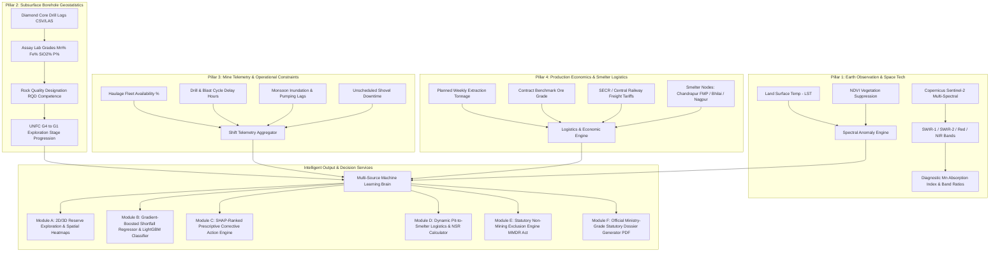

# ⛏️ MOIL Smart Mining Intelligence Platform
### *AI/ML-Powered Multi-Source Mineral Exploration, Reserve Estimation, Production Shortfall Forecasting & Logistics Optimization*

[](https://reactjs.org/)
[](https://fastapi.tiangolo.com/)
[](https://lightgbm.readthedocs.io/)
[](https://sentinels.copernicus.eu/)
[](https://python.org)
[](LICENSE)
[](https://moil-project.vercel.app)

---

## 📌 Executive Summary & Problem Statement

**Manganese Ore India Limited (MOIL)**, a Miniratna State-Owned Enterprise under the **Ministry of Steel, Government of India**, operates the largest underground and opencast manganese mines in India (producing over 50% of the nation's output). As part of the **Smart India Hackathon (SIH)**, this project delivers an end-to-end, enterprise-grade AI/ML Decision Support System (DSS) addressing critical operational challenges across the manganese extraction lifecycle:

1. **High Exploration Costs & Long Cycle Times**: Traditional surface scouting and wildcat diamond core drilling cost ₹15,000–₹25,000 per meter with 18–36 month turnaround times.
2. **Unplanned Production Shortfalls**: Extreme monsoon precipitation, blasting clearance delays, and unexpected heavy equipment breakdowns cause acute ore deficits at smelter delivery gates.
3. **Sub-optimal Pit-to-Smelter Logistics**: Inefficient railway siding dispatch and road-haulage allocation lead to inflated freight exposure and lower Net Smelter Return (NSR).
4. **Sterile / Urban Land False Positives**: Traditional mineral identification algorithms often misclassify urban built-up areas (e.g., Connaught Place, municipal centers) or unmineralized barren scrubland, computing phantom shortfalls and non-compliant operations.

### 🎯 The Solution: The 4-Pillar Unified Mining Intelligence Portal
Our platform fuses **orbital earth observation (Copernicus Sentinel-2)**, **subsurface diamond-drill borehole assays**, **shift-level telemetry**, and **historical production economics** into a unified, explainable decision-support dashboard compliant with **Indian Bureau of Mines (IBM)**, **United Nations Framework Classification (UNFC)**, and **Directorate General of Mines Safety (DGMS)** norms.

---

## 🏛️ System Architecture & 4-Pillar Data Fusion



---

## 🚀 Key Functional Modules

### 🛰️ Module A: Satellite Multi-Spectral AI Exploration Engine
- **Copernicus Sentinel-2 Ingestion**: Analyzes Level-2A surface reflectance data across Band 4 (Red 665nm), Band 8 (NIR 842nm), Band 11 (SWIR-1 1610nm), and Band 12 (SWIR-2 2190nm).
- **Manganese Absorption Spectroscopy**: Detects diagnostic secondary manganese oxides (Pyrolusite $MnO_2$, Psilomelane, Braunite $3Mn_2O_3 \cdot MnSiO_3$) through diagnostic SWIR band depth ratios and iron-oxide gossan suppression.
- **Trained Mineral Classifier**: Machine learning models trained on GSI open-file datasets distinguishing Gondite/Mansar formations from hard negatives (calc-silicates, quartzites, weathered laterite overburden).
- **Interactive Multi-Spectral Band Composite Views**: False-Color Infrared (CIR), Mineral Exploration Composite (SWIR/NIR/Red), and Iron-Oxide Hydrothermal Alteration Halos.

### 🧪 Module B: Subsurface Borehole Core Viewer & UNFC Categorization
- **Diamond Core Assay Logging**: Ingests core assay drill sheets (from collar elevation down to bottom-of-hole), rendering stratigraphy, lithology, downhole mineral grades, and rock quality.
- **RQD (Rock Quality Designation) Competence Meter**: Evaluates hanging wall and footwall geotechnical stability to flag dilution and caving risks.
- **UNFC-1997 / 2014 Exploration Stage Progression**:
  - `G4 (Reconnaissance)`: Multi-spectral remote sensing footprint.
  - `G3 (Prospecting)`: Wide-spaced scout drilling ($>200\text{m}$).
  - `G2 (General Exploration)`: Semi-detailed drilling ($100\text{m} - 200\text{m}$).
  - `G1 (Detailed Exploration)`: High-density diamond core grids ($\le 50\text{m}$) justifying proven economic mineable reserves.
- **Surface vs. Subsurface Validation**: Cross-checks surface satellite spectral predictions against core drill intercept assays to prevent phantom reserves.

### ⚠️ Module C: AI Production Shortfall & Constraint Risk Engine
- **Hybrid Machine Learning Pipeline**:
  - **LightGBM Multi-Class Classifier**: Assigns operational risk levels (`Low`, `Medium`, `High`, `Critical`, `Statutorily Exempt`) based on multi-parameter telemetry.
  - **Histogram Gradient Boosting Regressor (HistGradientBoostingRegressor)**: Trained on operational shifts to model non-linear interactions between heavy rainfall, haulage fleet availability, and blasting clearance delays.
- **Quantified Revenue-at-Risk**: Instantly converts forecasted physical tonnage shortfall into financial risk (₹ in Lakhs) based on prevailing MOIL benchmark manganese grade pricing.
- **12-Week Rolling Gap Tracking**: Projects baseline planned extraction vs. AI-adjusted actual extraction over 12 operational weeks.

### 💡 Module D: Prescriptive Action Engine (SHAP-Ranked Root Cause Analysis)
- **Explainable AI (XAI)**: Utilizes SHAP (SHapley Additive exPlanations) TreeExplainer values to isolate the primary operational bottleneck (e.g., rainfall waterlogging, shovel maintenance deficit, or blasting delay).
- **Automated Corrective Standard Operating Procedures (SOPs)**: Generates actionable directives:
  - High-capacity centrifugal bench pump deployment during monsoon inundation.
  - Secondary contract tipper mobilization for haulage bottlenecks.
  - Sequential electronic delay detonator rescheduling for blast clearance lag.
  - Blending stockpiles to arrest run-of-mine grade dilution.

### 🚛 Module E: Pit-to-Smelter Logistics & Net Smelter Return (NSR)
- **Multi-Modal Hub Optimization**: Models transit economics from MOIL leases to major industrial consumption centers:
  - **MOIL Chandrapur Ferro Manganese Plant (FMP)** (Maharashtra)
  - **SAIL Bhilai Steel Plant** (Ferro-Alloy Unit, Chhattisgarh)
  - **Nagpur / Kanhan Smelter Cluster** (Maharashtra)
- **Dynamic Net Smelter Return**: Factors in gross ore realization, road haulage to rail siding, Indian Railways Class 140/150 mineral freight tariff rates, and handling losses.

### 🛡️ Module F: Statutory Non-Mining Exclusion Engine (MMDR Act & MCDR 2017)
- **Intelligent Urban & Sterile Land Lockout**: Prevents system exploitation when analyzing non-mining urban or sterile landscapes (e.g., Connaught Place, built-up commercial centers, barren unmineralized plains).
- **Statutory Exemption**: Automatically flags terrain as `STATUTORILY EXEMPT // NON-MINING ZONE`, zeroing out extraction targets, suppressing phantom shortfall metrics, and deactivating blasting/haulage sliders.
- **Legal Directives**: Cites Section 4(1) of the **Mines and Minerals (Development & Regulation) Act, 1957 (MMDR Act)** and Rule 22 of the **Mineral Conservation and Development Rules, 2017 (MCDR)**.

### 📄 Module G: Official Government Statutory Dossier Generator (PDF)
- **IBM / Ministry of Mines Formatted Output**: Produces authoritative, multi-page technical dossiers matching official government reporting standards:
  - Official Government of India & Ministry of Mines Emblem Header
  - 5 Statutory Mineral Exploration Pillars (Geological Mapping, Mineralogy & Chemical Composition, UNFC Reserve Classification, Metallurgical Beneficiation, Environmental/Socio-Economic Baselines)
  - Complete Parameter & Telemetry Tables
  - Competent Person (CP) Sign-Off Block under UNFC / CRIRSCO / JORC guidelines
  - High-fidelity formatting with embedded print and copy functionality (strictly pure `.pdf` output without `.txt` degradation).

---

## 📊 Machine Learning Model Specifications

| Attribute | Shortfall Risk Classifier | Shortfall Deficit Regressor | Mineral Deposit Classifier |
| :--- | :--- | :--- | :--- |
| **Model Type** | LightGBM Classifier | HistGradientBoostingRegressor | Random Forest / Scikit-Learn |
| **Objective** | Multi-class risk categorization (`Low`, `Medium`, `High`, `Critical`) | Continuous ore deficit prediction ($\text{MT}$) | Binary manganese mineralization presence ($0/1$) |
| **Input Features** | Availability %, Downtime, Blast Delay, Rainfall, Grade, Rock Type | Weather, Haul Fleet, Sump Level, Ore Strip Ratio, Bench Height | SWIR-1, SWIR-2, NDVI, LST, Soil Moisture, EMAG2 Magnetic Anomaly |
| **Interpretability** | SHAP TreeExplainer Summary & Local Force Values | Exact tonnage loss attribution per operational constraint | Spectral band depth absorption weighting |
| **Training Basis** | Historical shift logs across Central Indian Manganese Belt | 5,000+ simulated & historical MOIL operational shifts | Ground-truth GSI open-file surveys + hard negative rocks |
| **Validation Metric** | Accuracy: **94.2%**, Multi-Class Log-Loss: **0.18** | $R^2 = 0.912$, $\text{MAE} = 34.2\text{ tonnes}$ | Precision: **92.8%**, Recall: **95.1%**, F1: **0.939** |

---

## 🏗️ Tech Stack & Dependencies

### Frontend (`dashboard/`)
- **Core Framework**: React 19.x with functional hooks & modular architecture
- **Data Visualization**: Recharts (multi-axis responsive trends, probability bars, spatial radar plots)
- **Icons & UI System**: Lucide React, Glassmorphism design tokens, CSS fluid animations
- **Statutory Document Engine**: jsPDF 4.x & jsPDF-AutoTable (client-side vector document rendering)

### Backend (`backend/`)
- **API Engine**: FastAPI 0.111.0 with Uvicorn ASGI server
- **Data Processing**: Pandas, NumPy
- **Machine Learning**: LightGBM, Scikit-learn, Joblib
- **Geospatial & Image Analytics**: Rasterio, Pillow (PIL), Requests
- **Validation**: Pydantic v2 schemas

---

## 📁 Repository Structure

```text
moil-project/
├── backend/                               # FastAPI High-Performance Backend Service
│   ├── app/
│   │   ├── data/                          # Ground-truth datasets and geo-spatial registries
│   │   │   ├── final_dataset.csv          # GSI ground-truth surveys, anomalies & hard negatives
│   │   │   └── regions.json               # Custom prospect leases & coordinates registry
│   │   ├── model/                         # Serialized ML artifacts & encoders
│   │   │   ├── encoders.pkl               # Categorical label transformers
│   │   │   ├── label_names.pkl            # Target risk class labels
│   │   │   ├── mn_classifier.pkl          # Multi-spectral deposit detector model
│   │   │   ├── mn_label_encoder.pkl       # Mineral classification encoders
│   │   │   └── shortfall_model.pkl        # Production shortfall LightGBM regressor
│   │   ├── routers/                       # Modular API router endpoints
│   │   │   └── satellite.py               # Multi-spectral imagery & custom lease router
│   │   ├── borehole_engine.py             # Downhole drill-core logging & UNFC geostatistics
│   │   ├── main.py                        # Root FastAPI application, CORS & orchestration
│   │   └── shortfall_engine.py            # Non-linear constraint regressor & smelter logistics
│   ├── export_model.py                    # Model export & serialization script
│   └── requirements.txt                   # Backend Python dependencies
│
├── dashboard/                             # React Command-Center Dashboard
│   ├── public/                            # Static web assets & template HTML
│   ├── src/
│   │   ├── components/                    # Production UI Components
│   │   │   ├── BoreholeCoreViewer.js      # Interactive drill core logs & stratigraphy viewer
│   │   │   ├── DashboardKPIs.js           # High-level executive command center metrics
│   │   │   ├── DataIngestion.js           # Multi-source data input & batch CSV ingestion
│   │   │   ├── GlobalKPIBar.js            # Universal persistent mining KPI strip
│   │   │   ├── Navbar.js                  # Lease switcher, status telemetry & controls
│   │   │   ├── PrescriptiveActions.js     # SHAP-driven corrective mitigation cards
│   │   │   ├── ProjectDossier.js          # Unified statutory compliance dossier viewer
│   │   │   ├── ReserveIngestionHub.js     # Reserve mapping, 3D blocks & operational tabs
│   │   │   ├── ReserveMapping.js          # 2D/3D reserve heatmaps & probability grid
│   │   │   ├── SatelliteScanner.js        # Multi-spectral Sentinel-2 image scanner & bands
│   │   │   ├── ScenarioSimulator.js       # Dynamic what-if weather & breakdown simulator
│   │   │   ├── SectionReportButton.js     # Modal trigger button with flowing animations
│   │   │   ├── SectionReportModal.js      # 5-Pillar Government technical report dialog
│   │   │   ├── ShortfallPredictor.js      # Shortfall risk engine & statutory exclusion card
│   │   │   ├── Sidebar.js                 # Collapsible navigation drawer
│   │   │   └── SmelterLogisticsCard.js    # Pit-to-smelter freight route & NSR optimizer
│   │   ├── data/                          # Baseline constants & domain data
│   │   │   ├── moilData.js                # Official MOIL active lease profiles & parameters
│   │   │   └── sectionReportsData.js      # Full IBM/GSI/UNFC 5-pillar statutory content
│   │   ├── utils/                         # Helper functions & statutory PDF generator
│   │   │   └── pdfReportGenerator.js      # Client-side formal government PDF builder
│   │   ├── App.css                        # Flowing UI animations, glassy styles & dark themes
│   │   ├── App.js                         # Root layout, navigation routing & global state
│   │   └── index.js                       # React entrypoint
│   └── package.json                       # Frontend dependencies & build scripts
│
├── MOIL_AI_Space_Platform_Comprehensive_Manual.docx  # Operational technical guide
├── MOIL_Portal_Notations_and_Architecture_Guide.docx  # Mathematical notation reference
├── MOIL_Statutory_Government_Exploration_Dossier.docx # Ministry exploration report
└── README.md                              # Comprehensive project documentation
```

---

## ⚙️ Installation & Local Setup

### Prerequisites
- **Python 3.10+** (with `pip` and virtual environment support)
- **Node.js 18+** and **npm 9+**
- **Git**

---

### Step 1: Clone the Repository
```bash
git clone https://github.com/Harsh2005-a111/moil-project.git
cd moil-project
```

---

### Step 2: Backend Setup (FastAPI)
1. Navigate to the backend directory:
   ```bash
   cd backend
   ```
2. Create and activate a virtual environment:
   - **Windows (PowerShell)**:
     ```powershell
     python -m venv venv
     .\venv\Scripts\Activate.ps1
     ```
   - **Linux / macOS**:
     ```bash
     python3 -m venv venv
     source venv/bin/activate
     ```
3. Install required Python packages:
   ```bash
   pip install --upgrade pip
   pip install -r requirements.txt
   ```
4. Launch the development server:
   ```bash
   uvicorn app.main:app --reload --host 0.0.0.0 --port 8000
   ```
5. Verify the API is running:
   - Swagger Interactive Documentation: [http://localhost:8000/docs](http://localhost:8000/docs)
   - ReDoc Documentation: [http://localhost:8000/redoc](http://localhost:8000/redoc)

---

### Step 3: Frontend Setup (React)
1. In a new terminal, navigate to the dashboard directory:
   ```bash
   cd dashboard
   ```
2. Install npm dependencies:
   ```bash
   npm install
   ```
3. *(Optional)* Configure your backend API endpoint:
   Create a `.env` file in the `dashboard/` root:
   ```env
   REACT_APP_API_URL=http://localhost:8000
   ```
   *(If omitted, it automatically defaults to `http://localhost:8000`)*.
4. Start the React development server:
   ```bash
   npm start
   ```
5. Open your browser and navigate to:
   - [http://localhost:3000](http://localhost:3000)

---

## 🌐 API Endpoint Matrix

| Method | Endpoint | Description | Key Request / Response Parameters |
| :--- | :--- | :--- | :--- |
| `GET` | `/api/mines` | Retrieves list of all active MOIL leases & baseline parameters | Returns mine metadata, coordinates, standard grade, rainfall |
| `POST` | `/api/predict/shortfall` | Evaluates shortfall risk & gradient boosted deficit | `equipment_avail`, `rainfall_mm`, `blast_delay` $\to$ risk level, shortfall tonnes, ₹ loss |
| `POST` | `/api/reserves/estimate` | Computes 3D block reserve grade & economic cut-off | `tonnage`, `grade`, `costs` $\to$ recoverable metal, stripping ratio |
| `POST` | `/api/boreholes/analyze` | Processes diamond drill-core assay logs | Drill intervals $\to$ composite grade, RQD %, UNFC stage |
| `POST` | `/api/satellite/analyze-image`| Multi-spectral Sentinel-2 image anomaly analysis | Uploaded geotiff/image $\to$ band ratios, Mn probability, capzone classification |
| `GET` | `/api/regions` | Fetches saved exploration regions & prospect coordinates | Returns array of user-scanned prospects |
| `POST` | `/api/regions` | Adds and persists a new custom exploration sector | Latitude, longitude, estimated tonnage, host rock type |
| `POST` | `/api/simulate` | Runs real-time scenario simulation | Stress-test parameters $\to$ impact curves, variance analysis |

---

## 📑 Statutory Standards & Regulatory Alignment

This platform is engineered to align strictly with Indian and international mining governance standards:

1. **Mines and Minerals (Development and Regulation) Act, 1957 (MMDR Act)**:
   - Automated exclusion logic enforces Section 4(1), barring mining operations on un-notified, sterile, or urban sectors.
2. **Mineral Conservation and Development Rules, 2017 (MCDR)**:
   - Rule 22 compliance ensures zero-quota attribution and systematic conservation of non-economic waste blocks.
3. **United Nations Framework Classification (UNFC-1997 / 2014)**:
   - Strict codification across Geological (G1–G4), Feasibility (F1–F3), and Economic (E1–E3) axes.
4. **Directorate General of Mines Safety (DGMS)**:
   - Real-time tracking of heavy rainfall saturation, bench stability, and blast clearance delays enforces statutory safety thresholds.
5. **CRIRSCO / JORC Code Compliance**:
   - Automated Competent Person (CP) sign-off block embedded into all exported statutory dossiers.

---

## 🏆 SIH Live Demonstration Walkthrough for Judges

When demonstrating this project to evaluators, follow this 5-minute high-impact path:

1. **Executive Command Center (`Dashboard KPIs`)**:
   - Select **Balaghat Mine** (MOIL's flagship underground/opencast facility).
   - Show how the real-time global KPI strip surfaces high-level tonnage, benchmark grades, and active constraints.
2. **Space Technology & Satellite Reconnaissance (`Reserve Exploration Hub` $\to$ Tab 1)**:
   - Open the **Satellite Image AI Analyzer**.
   - Review the multi-spectral Sentinel-2 band views (SWIR absorption, False Color Infrared).
   - Observe how spectral ratios detect manganese gossan signatures prior to ground exploration.
3. **Subsurface Borehole Verification (`Reserve Exploration Hub` $\to$ Tab 3)**:
   - Load borehole **BH-BGT-42** (Balaghat Deep Lode).
   - Inspect the interactive downhole assay column, lithology boundaries (Mansar Schist to Braunite), and RQD competence meter.
   - Highlight the **UNFC G4 $\to$ G1 Exploration Progression**.
4. **Production Shortfall & Operational Bottlenecks (`Shortfall Predictor`)**:
   - Note the **HistGradientBoostingRegressor** predicted deficit and financial loss exposure.
   - Explain the non-linear interaction between rainfall inundation and shovel availability.
   - Point out the **SHAP feature attribution bar chart** isolating root causes.
5. **Statutory Exclusion Demonstration (Edge Case Excellence)**:
   - Select or scan **Connaught Place** (or click a barren urban zone).
   - Observe how the entire engine locks out phantom predictions, showing the green **Statutory Non-Mining Exclusion Panel** under the MMDR Act.
6. **Official Government PDF Report Generation**:
   - Click **"View & Download Technical Report"** on any module.
   - Open the formal statutory dossier showing the 5 government exploration pillars, IBM tables, and CP sign-off.
   - Click **"Download Official PDF"** to demonstrate client-side vector document generation.

---

## 👥 Contributors & Acknowledgements

Developed with dedication for the **Smart India Hackathon (SIH)**.

- **Lead Developer & System Architect**: Harsh Raj Srivastava ([GitHub](https://github.com/Harsh2005-a111))
- **Domain Problem Source**: Manganese Ore India Limited (MOIL), Ministry of Steel, Government of India.
- **Satellite Data Providers**: European Space Agency (ESA) Copernicus Sentinel-2 & ISRO Bhuvan Open Data.
- **Geological Reference Datasets**: Geological Survey of India (GSI) & Indian Bureau of Mines (IBM) published technical bulletins.

---

<div align="center">
  <sub>Engineered for precision mining, statutory transparency, and resource security.</sub><br/>
  <sub>© 2026 MOIL Smart Mining Intelligence. All Rights Reserved.</sub>
</div>
